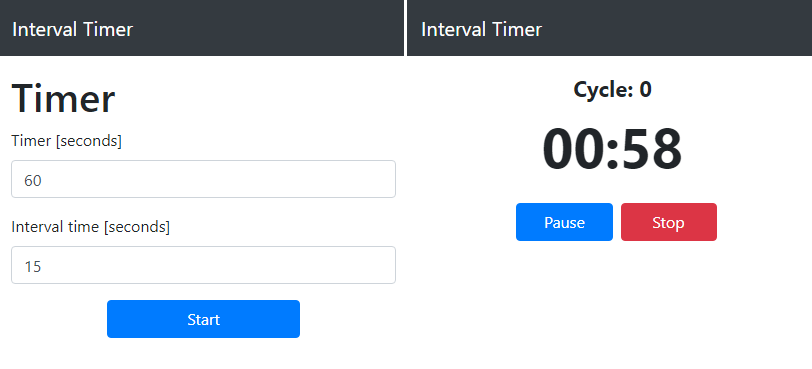

# Interval Timer
[Interval Timer](https://mmarszal7.github.io/) is an application that allows you to customise your work/interval cycles. The timer can be used for workouts or as the Pomodoro timer. In addition the timer can be used on:
- web
- desktop (with cross-platform Electron configuration) 
- mobile as an PWA. 

The timer has sound and vibration indications.

## How to install?
- clone repository
- npm install
- npm run start

To build & run electron app just type: **npm run electron-build** 
You can also try PWA features [here!](https://mmarszal7.github.io/)

## Main application views:

 

## Technologies used:
- React
- Redux
- Bootstrap
- Electron